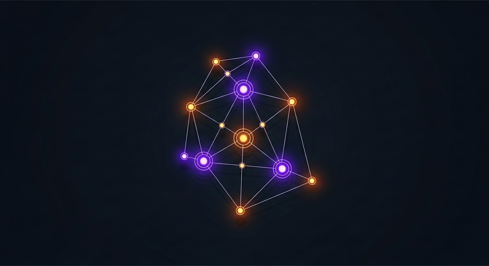
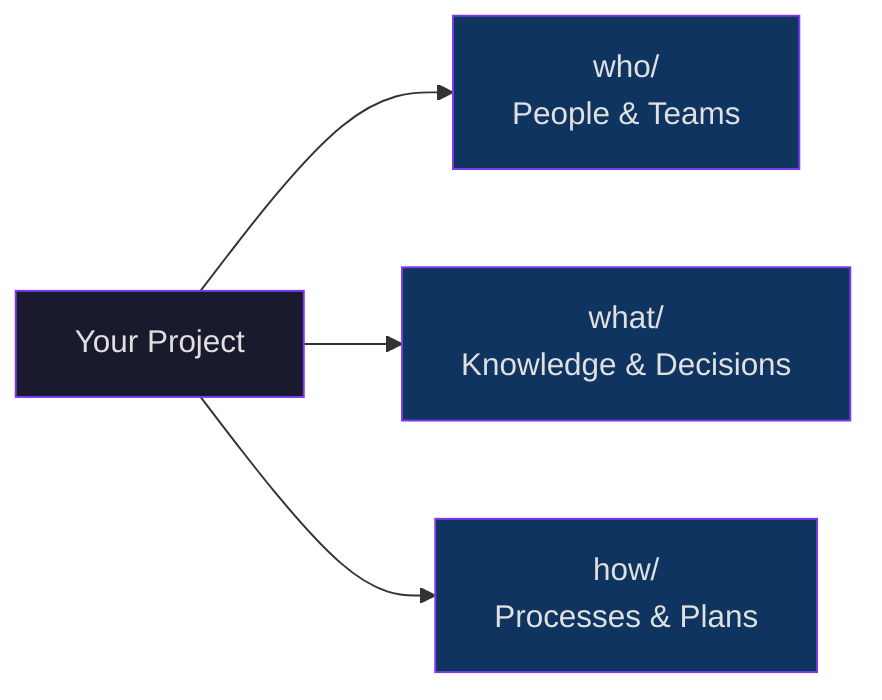
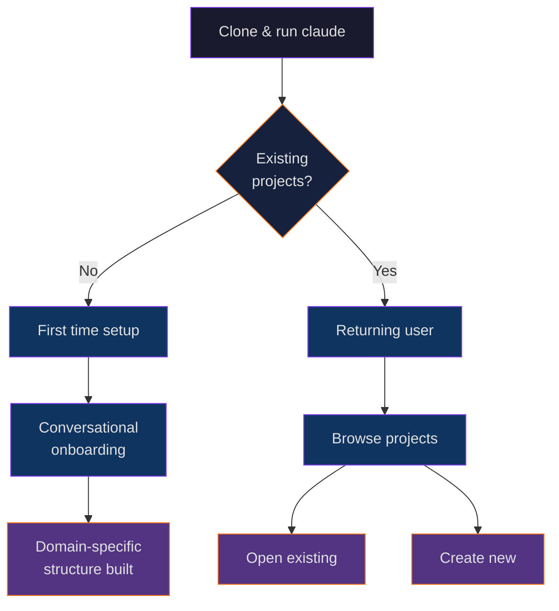
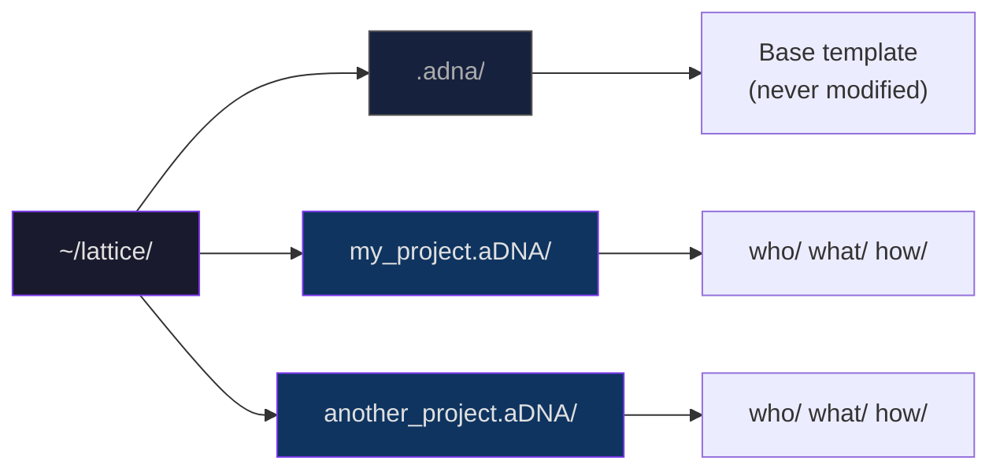
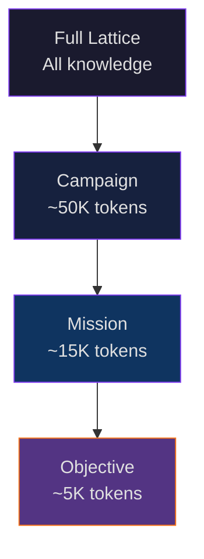

<p align="center">
  
</p>

# Agentic-DNA

[](LICENSE)
[](https://obsidian.md)
[](https://docs.anthropic.com/en/docs/claude-code)
[](.adna/CONTRIBUTING.md)
[](https://python.org)

**Give your projects a knowledge architecture that grows with you.**

---

## What Is a Lattice?

A lattice is a graph of graphs — a mathematical structure where interconnected systems compose into something greater than their parts.

Your knowledge naturally forms one. Every project, every domain, every collaboration is a node. As you create more, your lattice grows — not as scattered files and forgotten docs, but as structured, navigable, composable knowledge.

This repo is where you plant the seed.

---

## What Is aDNA?

**aDNA (Agentic DNA)** is the architecture inside each node of your lattice. It organizes any project's knowledge into three directories:

```
who/     →  Who is involved?                 (people, teams, organizations)
what/    →  What does this project know?     (knowledge, decisions, artifacts)
how/     →  How does this project work?      (processes, plans, operations)
```



Small config files (`AGENTS.md`) in each directory give AI agents instant orientation. Humans browse the same structure as a knowledge graph in [Obsidian](https://obsidian.md). One architecture, two audiences, zero divergence.

No proprietary dependencies. Folders, Markdown, and a handful of conventions — works with any editor, any AI agent, any version control.

---

## Getting Started

```bash
# 1. Clone to your home directory
git clone https://github.com/LatticeProtocol/Agentic-DNA.git ~/lattice

# 2. Open it
cd ~/lattice

# 3. Start Claude Code — it knows what to do
claude
```

Claude reads the workspace config, introduces aDNA, and walks you through creating your first project. The onboarding is conversational — tell it about your domain and it builds the right structure for you.

> [!TIP]
> New here? Run `git clone` → `cd ~/lattice` → `claude` — the AI walks you through everything.



---

## How It Works



The hidden `.adna/` directory is the base template — it contains everything (templates, skills, context library, lattice tools, Obsidian config). When you create a project, Claude forks `.adna/` into a new `project_name.aDNA/` directory with its own git repo.

Run `git pull` in `~/lattice/` anytime to update the template. Your projects are unaffected.

As your lattice grows, aDNA narrows context automatically — agents load only what the current task needs:



---

## What's Inside .adna/?

| Component | What it is |
|-----------|-----------|
| **Context library** | 5 topics, 27 subtopics (~75K tokens) of reusable domain knowledge |
| **22 templates** | Session, mission, campaign, context, ADR, and more |
| **13 agent skills** | Onboarding, project fork, quality audit, lattice publishing |
| **15 lattice examples** | YAML workflow definitions across biotech, business, creative, research |
| **Lattice tools** | Python validators, YAML↔Canvas converters, JSON Schema |
| **Obsidian config** | Theme, plugins, CSS snippets — runs `setup.sh` to install |
| **Full documentation** | 870-line README, aDNA standard, design docs, migration guides |

---

## Who Is This For?

aDNA works for any project that manages knowledge:

- **Researchers** — papers, datasets, experiments, collaborations
- **Founders** — investors, customers, product roadmap, fundraising
- **Creative professionals** — clients, projects, assets, revision cycles
- **Teams** — shared context, coordinated operations, persistent memory
- **Personal knowledge managers** — learning goals, reading notes, skills

Start with the base structure. Extend with domain-specific directories during onboarding.

---

## How aDNA Compares

| Feature | aDNA | Notion | PARA | Johnny Decimal | Zettelkasten |
|---------|------|--------|------|----------------|-------------|
| **AI agent support** | Native | None | None | None | None |
| **Human navigation** | Obsidian graph + folders | Web app | Folders | Numbered folders | Links + backlinks |
| **Structure** | 3-directory triad | Freeform pages | 4 categories | 10 areas x 10 cats | Flat + links |
| **Scales with AI** | Yes (context narrows) | Manual prompting | No agent model | No agent model | No agent model |
| **Portable** | Plain Markdown + folders | Proprietary | Concept only | Concept only | Concept only |
| **Execution system** | Campaign > Mission > Obj | Project views | Projects + Areas | Categories | None |
| **Version control** | Git-native | Proprietary | Depends on tool | Depends on tool | Depends on tool |
| **Collaboration** | Git + federation | Built-in sharing | N/A | N/A | N/A |

aDNA isn't a replacement for these systems — it's what happens when you need your knowledge architecture to work for AI agents *and* humans simultaneously. If you already use Obsidian or plain Markdown, aDNA is an upgrade to your folder structure, not a migration.

---

## Learn More

The full technical documentation lives inside `.adna/`:

- **[Detailed README](.adna/README.md)** — architecture deep-dive, lattice specification, all the details
- **[aDNA Standard](.adna/what/docs/adna_standard.md)** — formal specification
- **[Contributing](.adna/CONTRIBUTING.md)** — how to improve aDNA
- **[Changelog](.adna/CHANGELOG.md)** — version history

---

## License

[MIT](LICENSE) — use it for anything.

*aDNA is a standalone knowledge architecture. It is the foundational building block of the [Lattice Protocol](https://github.com/LatticeProtocol) for federated AI compute — but the architecture is domain-neutral. Any project benefits.*
